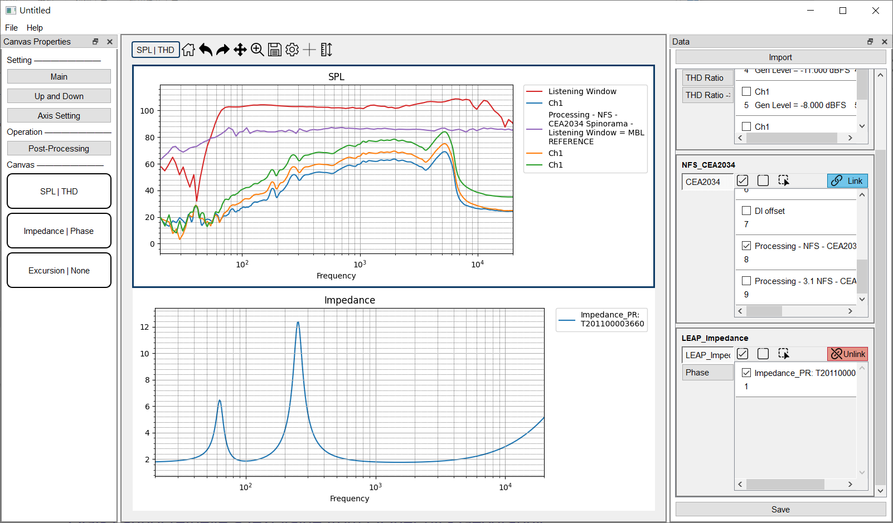
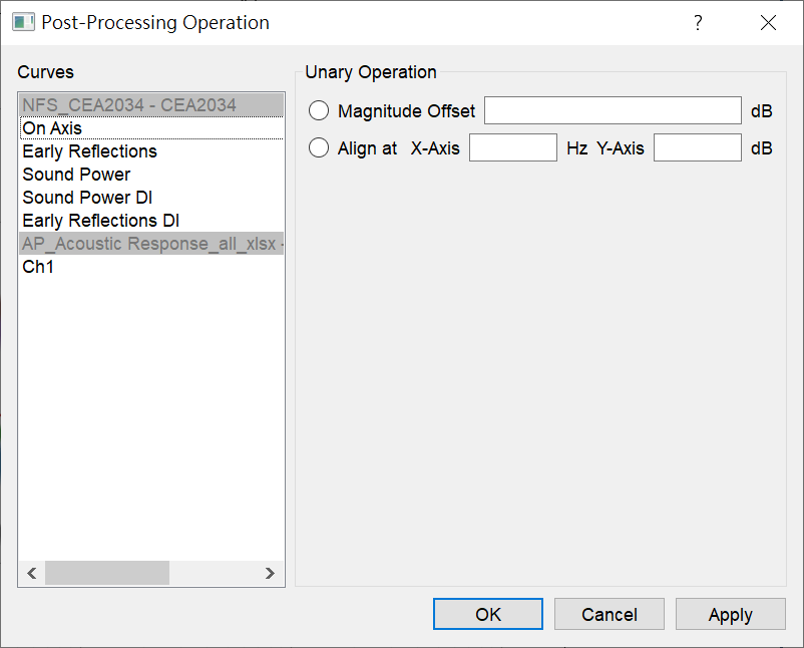

# GUI Introduction
SAE聲學測試時經常使用的軟體為AP、Klippel、LEAP、Comsol等。
同一個產品常常需要在不同軟體上測試並交叉驗證，但彼此的資料卻無法共享，因此想開發一款簡單的桌面應用程式，提供一個資料格式通用的繪圖平台，除了基本的繪圖之外，能做更進一步的資料後處理。

## Mainwindow 
視窗以專案為單位，同時可開啟不同專案的多個視窗。每個專案內可儲存匯入的資料與畫布的個人化設定。
使用者介面分成四大區域: [Menubar](#a-menubar)、[Canvas Layout](#b-canvas-layout)、[Data DockWidget](#d-data-dockwidget)、[Setting DockWidget](#e-setting-dockwidget)。

-------------------------------------------------
## A. Menubar 

### A-1. File:

- New Project: 開啟新的空白視窗。
- Open Project: 開啟指定的專案檔案(.pkl)。
- Save Project: 將專案資料儲存於原先的開啟路徑，若尚未儲存過則會讓使用者設定儲存路徑與專案名稱。
- Import File: 觸發匯入檔案的[對話視窗](#d-1-import-data)，匯入資料檔案於此專案中。

<!-- --------------- -->

### A-2. Help:
- Document: 開啟應用程式文件視窗。

-------------------------------------------------

## B. Canvas Layout
畫布區域，有兩種不同的排版模式Main/Up and Down，可於左方的Setting DockWidget中點選按鈕[切換](#e-1-canvas-layout-mode)。

Main

Up and Down

應用程式預設有三張畫布，每個畫布有兩個y軸，左邊為主軸，右邊為副軸，共用同一個x軸。
每個y軸有其負責繪製的資料類型，預設的組合為下:

| Canvas (id) | Main axis | Sub axis |
| ----------- | --------- | -------- |
| Canvas (0)  | SPL       | THD      |
| Canvas (1)  | IMP       | Phase    |
| Canvas (2)  | EXC       | None     |

| Mode        | Canvas set              |
| ----------- | ----------------------- |
| Main        | Canvas (0)              |
| Up and Down | Canvas (0) + Canvas (1) |

而這些預設的組合皆可由使用者變更設定。

-------------------------------------------------

## C. Toolbar
包含一列tool bar與畫布區域，有兩種不同的排版模式。

### C-1. Focusing Canvas
Toolbar上的功能只能針對一個特定畫布使用，故一個視窗只有一個目標畫布(Focusing Canvas)，以黑色邊框標示，也可從Toolbar左邊看目前作用的畫布是哪一個，在畫布上雙鍵點擊滑鼠左鍵可以切換目標畫布，如下動圖所示。

### C-2. Graph Properties
點選  顯示Graph Properties視窗，共有三個子頁，General、Axis、Curve。

<strong>General</strong>

<strong>Axis</strong>

- Margin: 畫布的邊框留白大小。
- Label: 曲線圖例顯示與否，圖例名稱換行的文字數目。

- 畫布上的三個軸: X軸、主Y軸、副Y軸。
- 可調整軸的範圍、標題、單位等等。

#### Curves

左方的表格紀錄目前在畫布上的曲線，可編輯曲線的Label名稱、Note註記、Color顏色、LineWidth線寬。

若檔案的狀態為Link，不同測項的曲線會合併於表格中顯示，曲線的更動也會自動變更至所有測項；若檔案的狀態為Unlink，則不同測項的曲線會分別於表格中顯示，曲線的更動就僅限於單一測項。

1. 點擊表格可選取曲線，按Tab跳至下一行，按Shift+Tab跳回上一行，會自動巡迴回標格最上方/最下方。
2. 在名稱/註記的儲存格上點擊之後，可直接輸入任意鍵進入編輯名稱/註記的狀態。
3. 按Enter/Tab皆會結束編輯跳至下一行。
4. 可以長按Shift/Curl選取多個曲線，並在右方Edit Style中輸入，會一次套用到被選取的曲線上。

### C-3. Draggable Cross lines
點選  可顯示一組垂直+水平線，使用滑鼠點擊線可拖拉線至預計標記的點，詳細座標標示於畫布右上角。

### C-4. AutoScale
點選  ，視窗會根據目前的資料調整y軸的範圍。

---------------------------------

## D. Data DockWidget
預設在右邊的浮動視窗，列出目前匯入的資料。
### D-1. Import Data
點擊Import觸發匯入檔案的對話視窗，匯入資料檔案於此專案中。

- APKLIPPELLEAPCOMSOL: 此應用程式支援四種測試軟體的[資料檔案](Data%20Source.md)，不同軟體的檔案類型與內部格式皆相異，匯入時請點擊相對應的按鈕。
  
- Delete: 刪除選取的檔案資料，可長按Shift鍵選取多項。

- Clear: 清空專案內的檔案資料。
<!-- - Export -->

### D-2. Files

此程式的資料結構與AP類似，每條測試曲線可連結多個測項，若右上角顯示為Link，使用者單一編輯會連動多個測項的資料，若右上角顯示為Unlink，則只會單獨使用當下選取測項的資料。

以動圖中的資料為例，從AP輸出的檔案包括RMS->Level->Smooth, THD Ratio, THD Level等3個測項(test)，共次3測試(measurement)，每個測試有兩個channel輸入，故共有6條曲線(curve)。
若為Link模式，勾選曲線會同時繪製3個測項的資料在相對應的畫布上。若為Unlink模式，因目前選取的測項為RMS->Level->Smooth，故只會繪製RMS->Level->Smooth的資料。
其他編輯也會受到Link/Unlink的模式影響，如[編輯曲線的名稱、顏色](#c-2-graph-properties)等。

#### Advance Selector
點選 顯示Advance Selector視窗。

<strong>Test</strong>

有勾選表示此測項內的資料可以使用、繪製、編輯。

而若是檔案包含重複(如RMS->Level/RMS->Level->Smooth)或是不支援的測項(如Impulse Response、Window等)，可以取消勾選，在後續繪製曲線時會忽略該測項。

<strong>Advance Selector</strong>

在自訂範圍內選取特定間距的曲線，若設定Start at: 1 / End at: 10 / Step: 4，會選取編號{1, 5, 9}的曲線。

<strong>Size</strong>

控制File單位方格的顯示大小。

### D-3. Save Project
點擊Save，將專案資料儲存於原先的開啟路徑，若尚未儲存過則會讓使用者設定儲存路徑與專案名稱。

-------------------------------------------------

## E. Setting DockWidget
預設在左邊的浮動視窗。
### E-1. Canvas Layout Mode

可切換畫布區域(Canvas Layout)的[模式](#b-canvas-layout)。
- Main :  單一畫布
- Up and Down: 上下兩個畫布。

### E-2. Axis Setting
點擊Axis Setting觸發對話窗，可調整畫布的主軸與副軸繪製的資料類別。

若想更動某一畫布的資料類別，則被更動的y軸上的圖形都會被清空。
而因每個資料類別無法同時繪製在兩個y軸上，故單一y軸的更動可能會同時影響兩張畫布。
例如，若想將Canvas 0畫布的主軸改為Impedance，而Impedance原本為Canvas 1的主軸，故會同時清除Canvas 0畫布與Canvas 1畫布的主軸，並將

### E-3. Post-Processing

點擊Post-Processing觸發資料後處理的對話窗，此對話窗僅適用在目前畫布上的曲線，列於在圖下左方列表中。

使用者可在左邊選取欲處理的曲線，並於右邊選取後處理的類型，可長按Shift鍵選取多個曲線，但只能一次執行一種後處理函式。
- Magnitude Offset 平移:以dB為單位，向上或向下平移。
- Align 對齊: 將選取的曲線對齊於特定的(x, y)位置。

### E-4. Canvas Objects
視窗預設的三種畫布示意圖，使用者可長按滑鼠左鍵拖拉至畫布中央，即可切換畫布。

EX: 原先Main模式下為SPL | THD，可將拖拉Impedance | Phase至畫布中放開，此時Main模式下的畫布就會切換成Impedance | Phase

